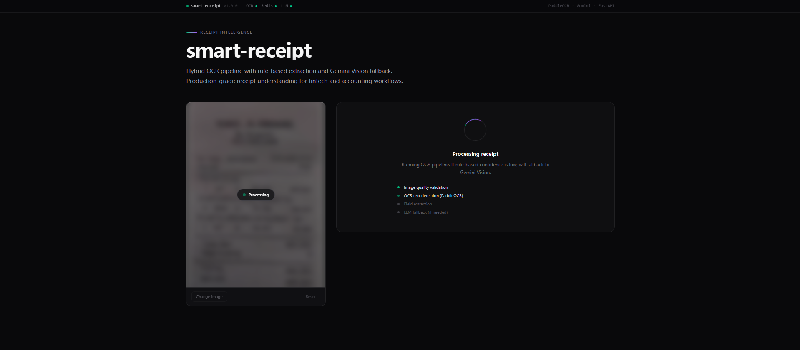
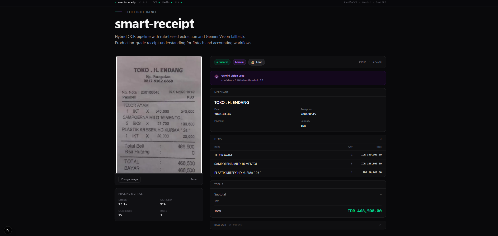
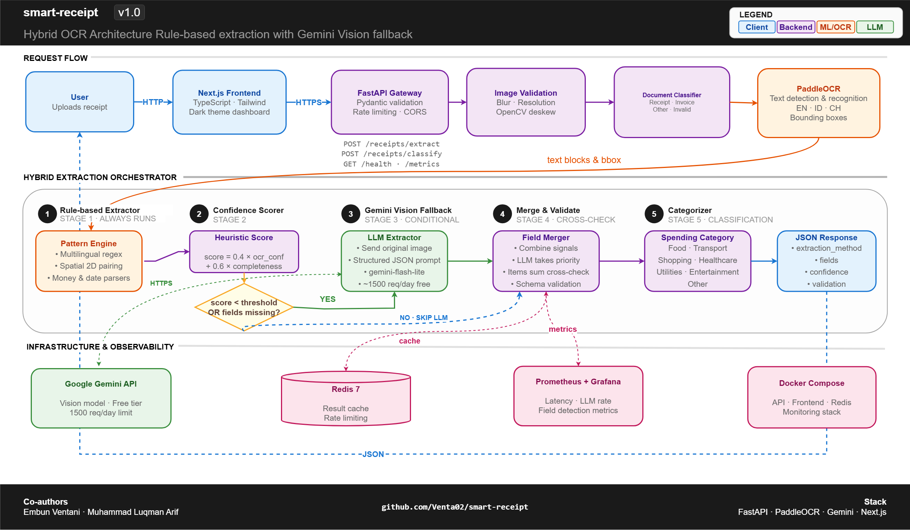

# smart-receipt

Hybrid receipt OCR with rule-based extraction and Gemini Vision fallback.
混合式收據 OCR — 規則引擎搭配 Gemini Vision 後援。

**Co-authors**
- Embun Ventani — [LinkedIn](https://id.linkedin.com/in/embun-ventani-34ba50206) · [GitHub](https://github.com/Venta02)
- Muhammad Luqman Arif bin Mohamad — [LinkedIn](https://www.linkedin.com/in/muhammadluqmanarifupm99) · [GitHub](https://github.com/arifmachinelearning)




---

## Why hybrid · 為何採用混合架構

Most receipt OCR projects pick one extreme. Pure rule-based is free and offline but plateaus at 65–80% accuracy. Pure LLM Vision reaches 95%+ but costs $0.40–10 per thousand requests and adds 4–8 seconds of latency. Neither fits production fintech workloads at scale.

大多數收據 OCR 專案選擇兩個極端之一。純規則引擎免費且可離線運作，但準確率停留在 65–80%。純 LLM Vision 可達 95% 以上，但每千次請求需 $0.40–10 且增加 4–8 秒延遲。兩者皆不適合大規模的金融科技生產環境。

This project tries rule-based extraction first, scores its own output, and only escalates to Gemini Vision when confidence is below threshold or critical fields are missing. The result is sub-second median latency on most requests with a graceful fallback for edge cases.

本專案先嘗試規則提取，自我評估信心分數，僅在信心低於閾值或關鍵欄位缺失時才升級至 Gemini Vision。多數請求達成亞秒級延遲，並對例外情況優雅降級。

| Approach 方案 | Accuracy 準確率 | Cost / 1k req. 成本 | Latency 延遲 |
|---|---|---|---|
| Rule-based only 純規則 | 65–80% | $0 | ~1s |
| LLM Vision only 純 LLM | 95–99% | $0.40–10 | 4–8s |
| **Hybrid 混合** | **92–98%** | **~$0.08** | **~1.2s avg** |

---

## Architecture · 架構



The system is organized into three layers. The **request flow** handles incoming uploads through validation, classification, and OCR. The **hybrid extraction orchestrator** is the core: rule-based extraction runs first, a confidence scorer decides whether to escalate to Gemini Vision, and a merger combines signals from both extractors. The **infrastructure layer** provides caching (Redis), observability (Prometheus + Grafana), and deployment (Docker Compose).

系統分為三個層次。**請求流程**處理上傳檔案的驗證、分類與 OCR。**混合提取協調器**是核心：規則提取優先執行，信心評分器決定是否升級至 Gemini Vision，合併器整合兩個提取器的訊號。**基礎設施層**提供快取（Redis）、可觀測性（Prometheus + Grafana）與部署（Docker Compose）。

The `extraction_method` field in every response indicates which path was taken: `rule_based`, `llm_fallback`, or `hybrid`. Transparency is part of the contract.

每個回應都包含 `extraction_method` 欄位，標示所採用路徑：`rule_based`、`llm_fallback` 或 `hybrid`。透明性是契約的一部分。

---

## Stack · 技術棧

**Backend.** FastAPI 0.115, PaddleOCR 2.7.3, Google Generative AI SDK, Redis 7, Prometheus, Pydantic 2.9, Docker. Lazy OCR model warmup; LLM client only initialized when API key is present.

**Frontend.** Next.js 14 (App Router), TypeScript, Tailwind CSS. Dark theme. Sticky two-column layout: image preview on the left, extraction results on the right.

**後端.** FastAPI、PaddleOCR、Google Generative AI SDK、Redis、Prometheus、Pydantic、Docker。延遲載入 OCR 模型；僅當 API 金鑰存在時才初始化 LLM 客戶端。

**前端.** Next.js 14、TypeScript、Tailwind CSS。深色主題。固定式雙欄佈局。

---

## Quick start · 快速開始

```bash
# Backend 後端
conda create -n smartreceipt python=3.11 -y
conda activate smartreceipt
pip install -r requirements.txt
cp .env.example .env  # add GEMINI_API_KEY 加入金鑰

# protobuf workaround required for PaddleOCR + Gemini coexistence
# PaddleOCR 與 Gemini 共存所需的 protobuf 解決方案
export PROTOCOL_BUFFERS_PYTHON_IMPLEMENTATION=python  # macOS / Linux
# $env:PROTOCOL_BUFFERS_PYTHON_IMPLEMENTATION="python"  # Windows PowerShell

uvicorn src.api.main:app --host 0.0.0.0 --port 8000
```

```bash
# Frontend 前端
cd frontend/nextjs_app
npm install
npm run dev
```

API: `http://localhost:8000` · UI: `http://localhost:3000` · Docs: `http://localhost:8000/docs`

Docker users: `docker-compose up -d` brings up the API, Redis, and monitoring stack.

---

## API

| Method | Path | Description 說明 |
|---|---|---|
| `GET` | `/health` | Health check including LLM availability · 健康檢查（含 LLM 狀態） |
| `POST` | `/receipts/extract` | Hybrid extraction pipeline · 混合提取流程 |
| `POST` | `/receipts/classify` | Document type classification · 文件類型分類 |
| `POST` | `/receipts/categorize` | Spending categorization · 消費分類 |
| `GET` | `/metrics` | Prometheus metrics · Prometheus 指標 |
| `GET` | `/docs` | Swagger UI |

**Example request 範例請求**

```bash
curl -X POST http://localhost:8000/receipts/extract \
  -F "file=@receipt.jpg" \
  -F "deskew=true"
```

**Response 回應**

```json
{
  "request_id": "uuid",
  "status": "success",
  "extraction_method": "llm_fallback",
  "fields": {
    "merchant_name": "TOKO . H. ENDANG",
    "receipt_date": "2020-01-07",
    "receipt_number": "200100545",
    "items": [
      {"name": "TELOR AYAM", "quantity": 1, "total_price": 340000},
      {"name": "SAMPOERNA MILD 16 MENTOL", "quantity": 5, "total_price": 108500},
      {"name": "PLASTIK KRESEK HD KURMA \"24\"", "quantity": 1, "total_price": 20000}
    ],
    "total": 468500,
    "currency": "IDR"
  },
  "confidence": 0.907,
  "category": "food",
  "validation": {"passed": true, "issues": [], "warnings": []},
  "latency_ms": 14283.5,
  "metadata": {
    "rule_based_confidence": 0.96,
    "fallback_reason": "confidence 0.96 below threshold 1.1",
    "llm_attempted": true
  }
}
```

---

## Configuration · 設定

```bash
# OCR
OCR_LANG=en              # en | id | ch
OCR_USE_GPU=false

# LLM Fallback (optional 選用)
GEMINI_API_KEY=AIza...
LLM_FALLBACK_ENABLED=true
LLM_MODEL=gemini-flash-lite-latest
CONFIDENCE_THRESHOLD=0.7  # 0.0–1.0, lower = more LLM calls 數值越低，呼叫 LLM 越頻繁
LLM_TIMEOUT_SECONDS=30

# Image
MAX_IMAGE_SIZE_MB=10
BLUR_THRESHOLD=100.0
```

`CONFIDENCE_THRESHOLD` controls the cost–accuracy tradeoff. `0.5` is aggressive cost optimization (~10% LLM calls). `0.7` is balanced. `0.95` prioritizes accuracy. `1.1` forces LLM on every request.

`CONFIDENCE_THRESHOLD` 控制成本與準確率的權衡。`0.5` 為積極成本優化，`0.7` 為平衡，`0.95` 偏向準確率，`1.1` 強制每次請求皆呼叫 LLM。

---

## Supported formats · 支援格式

English, Bahasa Indonesia (Rp, PPN, total bayar, tunai), and Malaysian (RM, SDN BHD, GST, SST). Detected fields include total, subtotal, tax, date, receipt number, items with quantity and price, currency, payment method, and merchant.

支援英文、印尼文（Rp, PPN, total bayar, tunai）及馬來西亞（RM, SDN BHD, GST, SST）。可提取欄位包含總額、小計、稅額、日期、收據編號、品項（含數量與價格）、貨幣、付款方式及商家名稱。

---

## Project structure · 專案結構

```
smart-receipt/
├── src/
│   ├── api/                      # FastAPI routes & dependencies
│   ├── core/                     # Config, logging, metrics
│   ├── models/                   # Pydantic schemas
│   ├── services/
│   │   ├── ocr/                  # PaddleOCR wrapper
│   │   ├── classification/       # Document classifier
│   │   ├── extraction/
│   │   │   ├── extractor.py      # Rule-based extractor
│   │   │   ├── llm_extractor.py  # Gemini Vision wrapper
│   │   │   ├── orchestrator.py   # Hybrid routing logic
│   │   │   ├── patterns.py       # Multilingual regex
│   │   │   └── parsers.py        # Date, money parsers
│   │   ├── validation/           # Image quality + field validators
│   │   └── categorization/       # Spending categorization
│   └── utils/
├── frontend/nextjs_app/          # Next.js dark theme UI
├── tests/
├── monitoring/                   # Prometheus + Grafana configs
├── docs/
├── docker-compose.yml
├── Dockerfile
└── requirements.txt
```

---

## Engineering notes · 工程說明

**PaddleOCR over Tesseract or EasyOCR.** Higher accuracy on Asian receipts (Chinese, Indonesian, Malaysian) and built-in angle classification. Tesseract struggles with rotated text; EasyOCR is slower at inference.

**PaddleOCR 而非 Tesseract 或 EasyOCR.** 對亞洲收據準確率較高，內建角度分類。Tesseract 處理旋轉文字效果差，EasyOCR 推論速度較慢。

**Gemini Flash Lite over GPT-4V.** Generous free tier (1500 requests/day), comparable accuracy on receipts, lower cost per request.

**Gemini Flash Lite 而非 GPT-4V.** 免費額度慷慨（每日 1500 次），收據場景準確率相近，每次請求成本較低。

**Hybrid over pure LLM.** At 1M receipts/month, pure LLM costs roughly $400. Hybrid with 20% fallback rate costs ~$80. Accuracy gap is small, cost difference is 5x.

**混合架構而非純 LLM.** 每月 100 萬次請求下，純 LLM 約需 $400，混合架構（20% 後援率）約需 $80。準確率差距小，成本差距達 5 倍。

**Protobuf workaround.** PaddlePaddle 2.6.2 requires `protobuf<=3.20.2`; the Google Generative AI SDK requires `protobuf>=5.0`. Setting `PROTOCOL_BUFFERS_PYTHON_IMPLEMENTATION=python` forces the pure-Python parser, which both libraries accept at the cost of ~5–10ms per OCR request.

**Protobuf 解決方案.** PaddlePaddle 2.6.2 需要 `protobuf<=3.20.2`，Google Generative AI SDK 需要 `protobuf>=5.0`。設定 `PROTOCOL_BUFFERS_PYTHON_IMPLEMENTATION=python` 強制使用純 Python 解析器，兩者皆相容，每次 OCR 請求約增加 5–10 毫秒。

---

## Limitations · 限制

- Rule-based accuracy degrades on multi-column layouts and unusual receipt formats. LLM fallback compensates when enabled.
- PaddleOCR sometimes misses very large header text (e.g., the merchant name on thermal-printed receipts). Gemini Vision reads the original image directly and handles these cases.
- LLM fallback adds 4–8 seconds latency on triggered requests. Acceptable for most workflows but not for sub-second use cases.
- GPU support has not been tested. PaddleOCR GPU mode requires CUDA setup.

- 規則提取在多欄位佈局與非典型收據格式下準確率下降；啟用 LLM 後援可彌補。
- PaddleOCR 偶爾會錯過非常大的標題文字（如熱敏列印商家名稱），Gemini Vision 直接讀取原圖可處理此類情況。
- LLM 後援會在觸發時增加 4–8 秒延遲，適合多數工作流程但不適合亞秒級需求。
- 尚未測試 GPU 支援。

---

## Roadmap

- [x] Rule-based extraction with spatial 2D pairing
- [x] Document classification
- [x] Gemini Vision fallback with confidence-based routing
- [x] Multilingual support (EN / ID / MY)
- [x] Validation layer with cross-checks
- [x] Spending categorization (7 categories)
- [x] Prometheus metrics
- [x] Frontend dashboard with extraction transparency
- [ ] Image preprocessing (CLAHE, sharpening)
- [ ] Batch processing endpoint
- [ ] Webhook callbacks for async extraction
- [ ] Multi-tenant API key authentication
- [ ] Deployment With Hugging face for Demo

---

## License · 授權

MIT
